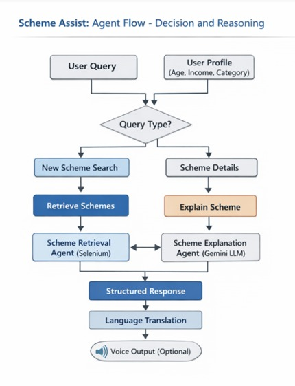

# 🏛️ Scheme Assist 
## Agentic AI–Based Government Scheme Guidance System
Scheme Assist is **an agentic AI-powered chatbot** designed to help users discover, understand, and explore **government schemes** they are eligible for
The system uses **FastAPI, LangChain, Gemini LLM, RAG, and automation tools** to provide accurate, personalized, and easy-to-understand responses.

---

## ✨ Key Features
- 🤖 Agentic AI architecture (decision + reasoning)
- 🔐 Secure authentication using JWT
- 🔍 Real-time scheme retrieval from official portals
- 🧠 LLM-based scheme explanation in simple language
- 💾 Memory layer using RAG + SQLite
- 🌐 Optional translation support
- 🔊 Optional voice output (TTS)
---

## 🧠 System Architecture

.jpeg)

**Figure 1:** Overall system architecture of Scheme Assist, showing the interaction between the user, frontend, backend services, AI agents, external government portals, and the memory layer.

---

## Agent Flow



**Figure 2:** Interaction and decision-making process between agents. The system dynamically decides whether to search for new schemes or explain existing schemes, ensuring accurate and context-aware responses.

---

## 📁 Project Structure

```text
FINAL PROJECT/
│
├── backend/
│   ├── tools/
│   │   ├── generate_scheme_info.py
│   │   └── search_for_schemes.py
│   │
│   ├── utils/
│   │   ├── gemini.py
│   │   ├── scheme_search.py
│   │   └── schemes.py
│   │
│   ├── agent.py
│   ├── auth.py
│   ├── database.py
│   ├── dependencies.py
│   ├── main.py
│   ├── models.py
│   ├── schemas.py
│   └── security.py
│
├── frontend/
│   ├── chat.html
│   └── login.html
│
├── .env
├── db.py
├── users.db
└── requirements.txt
```

---
## 🛠️ Technologies Used

### Backend
- Python 3.11
- FastAPI
- LangChain
- Google Gemini LLM
- JWT Authentication

### Frontend
- HTML
- CSS
- JavaScript

### Database
- SQLite

### AI & NLP
- LangChain Agents
- Retrieval-Augmented Generation (RAG)
- Google Generative AI (Gemini)

### Automation & Utilities
- Selenium
- WebDriver Manager

### Speech & Language
- SpeechRecognition
- pyttsx3
- Translation & Language Detection

---

## 📦 Required Libraries

Install all required dependencies using:

```bash
pip install -r requirements.txt
```

---

## 🚀 Installation & Setup
---
### 1️⃣ Clone the Repository

```bash
git clone https://github.com/anand528/Scheme-Assist-An-AI-Powered-Application-.git
cd Scheme-Assist-An-AI-Powered-Application-
```

### 2️⃣ Create Virtual Environment

```bash
python -m venv venv
```

Activate the environment:

### Windows

```bash
venv\Scripts\activate
```

### Linux / macOS

```bash
source venv/bin/activate
```

### 3️⃣ Install Dependencies

```bash
pip install -r requirements.txt
```

---

## 🔊 FFmpeg Setup (Required for Voice & Whisper)
---
FFmpeg is an external dependency and must be installed manually.

### Step 1: Download FFmpeg

Go to the official trusted site:

https://www.gyan.dev/ffmpeg/builds/

Download:

```text
ffmpeg-git-full.7z
```

or

```text
ffmpeg-git-full.zip
```

### Step 2: Extract

After extraction, ensure this structure exists:

```text
ffmpeg-git-full/
└── bin/
    ├── ffmpeg.exe
    ├── ffprobe.exe
    └── ffplay.exe
```

### Step 3: Move & Rename

Rename the folder:

```text
ffmpeg-git-full → ffmpeg
```

Move it to:

```text
C:\ffmpeg
```

Final path should be:

```text
C:\ffmpeg\bin\ffmpeg.exe
```

### Step 4: Add FFmpeg to PATH

1. Press **Win + S**
2. Search **Environment Variables**
3. Open **Edit the system environment variables**
4. Click **Environment Variables**
5. Under **System variables**, select **Path**
6. Click **Edit**
7. Click **New**
8. Add:

```text
C:\ffmpeg\bin
```

9. Click **OK**
10. Restart Command Prompt or Terminal.

### Step 5: Verify FFmpeg Installation

Open a new terminal and run:

```bash
ffmpeg -version
```

If version details appear, FFmpeg is correctly installed.

---

## ▶️ Running the Application
---
Run the backend:

```bash
cd backend
uvicorn main:app --reload
```

### Open the Frontend

Open the following files in your browser:

```text
frontend/login.html
```

```text
frontend/chat.html
```

---

## 🔮 Future Enhancements
---
- 🌐 Regional language support
- 🎙️ Voice-only interaction
- 📱 Mobile application
- 📋 Scheme application tracking
- 🔐 Aadhaar-based verification

---

## 👨‍💻 Author
---
**Chelli Anand Kumar**

B.Tech – AI & ML

---

## 🔗 Project Repository

https://github.com/anand528/Scheme-Assist-An-AI-Powered-Application-

